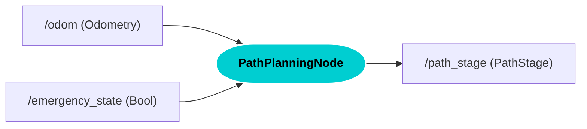
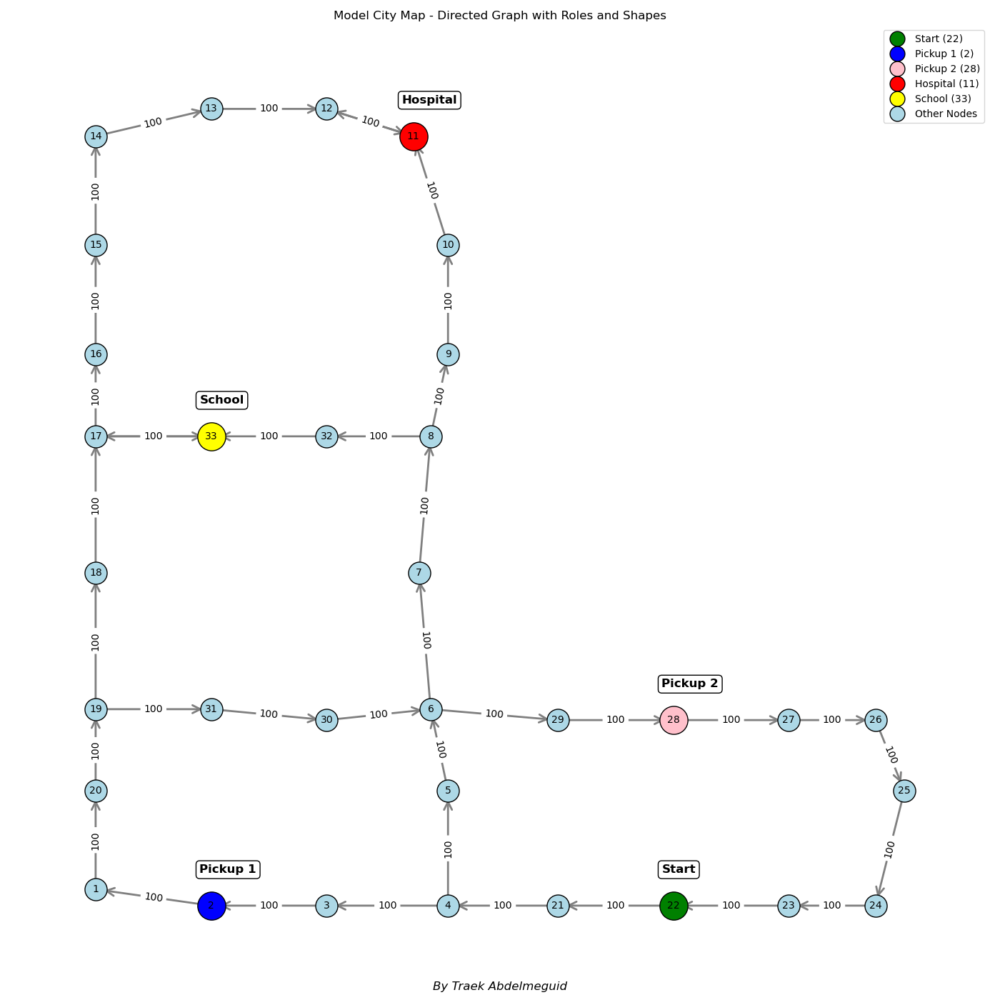
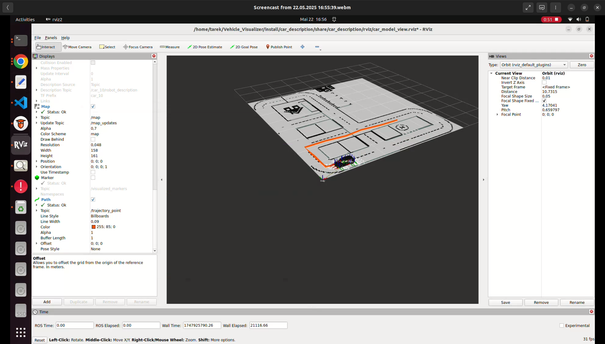

## 📚 Table of Contents

- [👨‍💻 Main Contributor](#-main-contributor)
- [🚗 Path Planning Overview](#-path-planning-overview)
- [Architecture Diagram](#architecture-diagram)
- [🧠 Algorithm](#-algorithm)
- [🔓 User Story 1](#-user-story-1)
- [Topics and Services](#topics-and-services)
- [Images](#images)
- [📦 Custom Message](#-custom-message)
- [Installation](#installation)
- [Launching the Node](#launching-the-node)
- [Author](#author)


## 👨‍💻 Main Contributor

**[Tarek Abdelmeguid](https://github.com/TarekAbdelmeguid)**  
Robotics Engineer  
Coburg University of Applied Sciences  
Master’s Student in Autonomous Driving


## 🚗 Path Planning Overview

This ROS 2 node implements **path planning** for an autonomous pupil transport vehicle navigating a simplified city represented as a graph. It uses the A* algorithm to generate an optimal route through key mission points, while also handling emergency rerouting logic.

### 📌 Features

- Subscribes to:
  - `/odom` – Receives vehicle's current position
  - `/emergency_state` – Monitors emergency conditions
- Publishes:
  - `/path_stage` – Custom `PathStage` message with planned trajectory and stage status
- Mission flow:
  1. Waits for `emergency_state = False` to begin the mission.
  2. Follows this goal sequence:
     - Pickup 1
     - Pickup 2
     - School
  3. If `emergency_state = True` at any time, reroutes immediately to the **hospital**.
  4. If the emergency clears, resumes the mission from the current location and next unfinished goal.
- Detects nearest node from vehicle's current location to plan realistic routes.
- Indicates if a goal is the **final stage** (school or hospital) via the `is_final_stage` flag.


## Architecture diagram



### 🧠 Algorithm

Uses the **A\*** search algorithm to find the shortest path between nodes based on a predefined city graph with nodes and directed edges.

      
                                     *Graph of Nodes with Target Goals *

## 🔓 **User Story 1**

> **As a Path Planning component, I want to generate routes based on the vehicle’s state—normal or emergency—so the ego-vehicle can follow a smooth path or safely reroute to the hospital when needed.**


### Acceptance Criteria
- **1.1**-The Path Planning component shall define a directed graph with (x, y) nodes and weighted edges, covering all driving scenarios in the model city.

- **1.2**-The Path Planning component shall subscribe to the /odom topic to receive the vehicle’s position and orientation.
  
- **1.3**-The Path Planning component shall subscribe to the /emergency_state topic to determine whether the vehicle is in normal or emergency mode.

- **1.4** -If /emergency_state is true, the component shall immediately plan a path from the current location to the hospital.

- **1.5**-If /emergency_state is false, the Path Planning component shall plan to the next goal at each step — first pickup, then second pickup, then school — advancing on each false condition.
  
- **1.6**-The Path Planning component shall use the A* algorithm to compute the optimal path between nodes.

- **1.7**-The component shall publish the planned path as a list of PathStage messages to the /path_stage topic, Each PathStage shall include:
Position (x, y) ,
is_final_stage (if True : final , false>waiting)

---


---

## Topics and Services

| Name               | Type                            | Description                                                |
|--------------------|---------------------------------|------------------------------------------------------------|
| `/odom`            | `nav_msgs/msg/Odometry`         | Provides the current vehicle position                      |
| `/emergency_state` | `std_msgs/msg/Bool`             | Indicates whether the vehicle should enter emergency mode  |
| `/path_stage`      | `custom_msg/msg/PathStage`      | Publishes the planned path and stage status                |

---
---

## Images



  
                              *Vehicle movement in RViz from pickup 1 to  pickup 2*

---

### 📦 Custom Message
PathStage.msg
-------------
std_msgs/Header header
geometry_msgs/PoseStamped[] poses
bool is_final_stage


## Installation

```bash
git clone https://github.com/TarekAbdelmeguid/Path-planning-project
cd Path-planning-project
colcon build
source install/setup.bash

---
```
## Launching the Node

```bash
ros2 run path_planning_pkg path_planning_node
```

---
